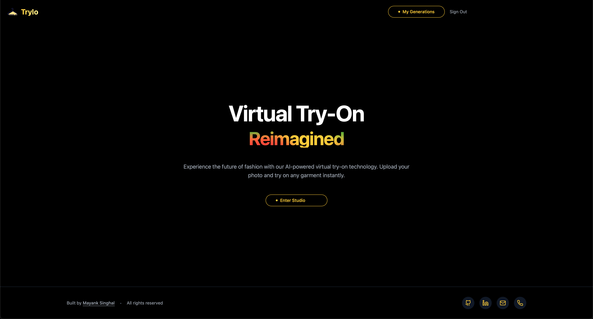

# Trylo - AI-Powered Virtual Try-On Platform

Trylo is a modern web application that lets users virtually try on clothes using AI technology. Built with Next.js 14 and powered by cutting-edge AI models, it provides a seamless and interactive virtual try-on experience.


## ✨ Features

### Current Features
- **Virtual Try-On Technology**: Upload your photo and try on any garment instantly
- **Multiple Garment Categories**: 
  - Tops
  - Bottoms
  - Full-body garments
- **Quality Settings**:
  - Fast Mode (~9 seconds)
  - Balanced Mode (~15 seconds)
  - Quality Mode (~20 seconds)
- **Smart Background Preservation**: Maintains original photo backgrounds
- **Interactive UI**:
  - Modern, responsive design
  - Smooth animations and transitions
  - Real-time processing status updates
- **User Management**:
  - Personal generation history
  - Secure authentication
- **Image Handling**:
  - Drag & drop support
  - Clipboard paste functionality
  - Multiple file upload methods

  

### Roadmap
- [ ] Mobile app development
- [ ] Batch processing for multiple garments
- [ ] AR integration for real-time try-on
- [ ] Social sharing features
- [ ] Integration with e-commerce platforms
- [ ] Custom background options

## 🛠 Tech Stack

- **Frontend Framework**: Next.js 14 (App Router)
- **Authentication**: NextAuth.js
- **Database**: Supabase
- **Storage**: Supabase Storage
- **Styling**: 
  - Tailwind CSS
  - shadcn/ui components
- **State Management**: React Context + Hooks
- **API Integration**: FASHN AI API
- **Development**:
  - TypeScript
  - ESLint
  - Prettier

## 🚀 Getting Started

### Prerequisites
- Node.js 18.x or higher
- npm/yarn
- Supabase account

### Environment Setup

```env
NEXT_PUBLIC_SUPABASE_URL=your_supabase_url
NEXT_PUBLIC_SUPABASE_ANON_KEY=your_supabase_key
```


### Running the App

```bash
npm run dev
```
## 📄 License

All rights reserved. See `LICENSE` for more information.

## 👥 Team

- **Mayank Singhal** - _Initial work_ - [@MynkSinghal](https://github.com/MynkSinghal)

## 📞 Contact

- Email: singhal2004mayank@gmail.com
- LinkedIn: [@mynkkkk](https://www.linkedin.com/in/mynkkkk/)
- GitHub: [@MynkSinghal](https://github.com/MynkSinghal)
